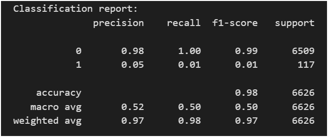
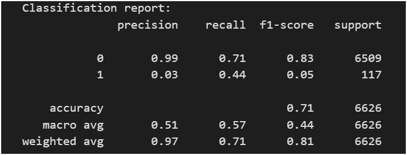

# Cancer Detection from Medical Images Using Convolutional Neural Networks

## Abstract

Skin cancer is among the most prevalent forms of cancer worldwide, and early diagnosis plays a crucial role in improving patient survival rates. In recent years, deep learning techniques, particularly Convolutional Neural Networks (CNNs), have demonstrated strong performance in medical image analysis tasks.

This project explores the application of CNN-based models for the automatic detection of skin cancer from dermoscopic images using the ISIC 2020 dataset. Both a baseline CNN model trained from scratch and a transfer learning approach using a pretrained EfficientNet architecture are implemented and evaluated.

---

## 1. Introduction

The diagnosis of skin cancer traditionally relies on expert dermatological examination, which can be time-consuming and subject to inter-observer variability. Automated image-based diagnostic systems can assist clinicians by providing fast and consistent predictions.  
The objective of this project is to develop a deep learning pipeline capable of classifying skin lesion images into benign and malignant categories, thereby supporting early cancer detection.

---

## 2. Dataset Selection and Motivation

### Why the ISIC 2020 Dataset Was Chosen

The ISIC 2020 dataset was selected due to several important reasons:

- It is a **large-scale and publicly available medical dataset**
- Images are collected from **real clinical settings**
- Ground-truth labels are provided and widely used in research benchmarks
- The dataset is specifically designed for **skin cancer classification tasks**

Using this dataset ensures that the developed models are trained on clinically relevant data and that results can be compared with existing research.

---

## 3. Data Understanding and Observations

Exploratory data analysis revealed several important characteristics of the dataset:

- The dataset exhibits **significant class imbalance**, with benign samples greatly outnumbering malignant ones
- Lesion images vary in color, texture, shape, and illumination
- Some malignant lesions visually resemble benign cases, making classification challenging even for humans

These observations motivated the use of data augmentation and transfer learning to improve generalization and robustness.

---

## 4. Methodology

### 4.1 Baseline CNN Model

A convolutional neural network was designed and trained from scratch using multiple convolutional, pooling, and fully connected layers. Batch normalization and dropout were incorporated to reduce overfitting.

The baseline model served as a reference point to evaluate how well a simple CNN could learn discriminative features directly from the dataset.

### 4.1.1 Classification Report:

## 

### 4.2 Transfer Learning with EfficientNet

To improve performance, a transfer learning approach was employed using EfficientNetB0 pretrained on ImageNet. The pretrained convolutional layers were frozen, and a custom classification head was added for binary classification.

This approach leverages learned feature representations from large-scale natural image data, which has been shown to be highly effective for medical imaging tasks.

### 4.2.1 Classification Report:

## 

---

## 5. Model Performance and Comparison

Among the implemented models, **EfficientNetB0 with transfer learning achieved the best performance**.

### Reasons for Superior Performance:

- Rich and hierarchical feature representations learned from large datasets
- Faster convergence during training
- Better generalization on unseen validation data
- Reduced overfitting compared to the baseline CNN

The baseline CNN, while effective to some extent, was limited in its ability to capture complex lesion patterns due to training from scratch on an imbalanced dataset.

---

## 6. Evaluation Strategy

Model performance was primarily evaluated using training and validation accuracy and loss trends. Visual inspection of predictions further helped in assessing model behavior.

It is important to note that in medical applications, metrics such as sensitivity, specificity, and ROC-AUC are critical and should be incorporated in future evaluations.

---

## 7. Conclusions

This project demonstrates that deep learning models can effectively learn meaningful representations from dermoscopic images for skin cancer detection. Transfer learning significantly outperforms models trained from scratch, particularly in scenarios with limited or imbalanced medical data.

The results highlight the importance of pretrained architectures in medical image analysis and confirm the feasibility of CNN-based approaches as supportive diagnostic tools.

---

## 8. Future Work

Several improvements can be explored in future studies:

- Incorporation of ROC-AUC, sensitivity, and specificity metrics
- Handling class imbalance using weighted loss functions
- Fine-tuning deeper layers of the pretrained model
- Extension to multi-class skin lesion classification
- Deployment of the model as a clinical decision-support system

---

## 9. Technologies Used

- Python
- TensorFlow / Keras
- NumPy and Pandas
- Matplotlib
- Scikit-learn

---
